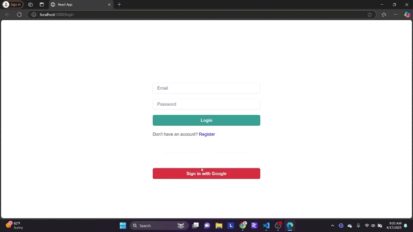

# React + Firebase Authentication + Express API + Google Sheets

A basic login page made with react which supports Authentication Google account.


## Features

- Login with Phone number
- Login with email & password
- Login with Google account


## Run Locally

Clone the project

```bash
  git clone https://github.com/NinadVyas/AuthFirebase.git
```


Install dependencies

```bash
  npm install
```

Start the server

```bash
  npm run start
```

----------------------------------------------------------------
## Video Result




----------------------------------------------------------------
## Install  Express googleapis (Middleware API)

new Folder Server

```bash
  mkdir server
```
install Server

```bash
  npm init -y
```
install librarry Express googleapis
```bash
  npm install express googleapis cors
```

Run Server (Server runing http://localhost:5000)
```bash
  node index.js
```

## Tech Stack

**Client:** React, JavaScript, Chakra UI

**Authentication** Firebase

